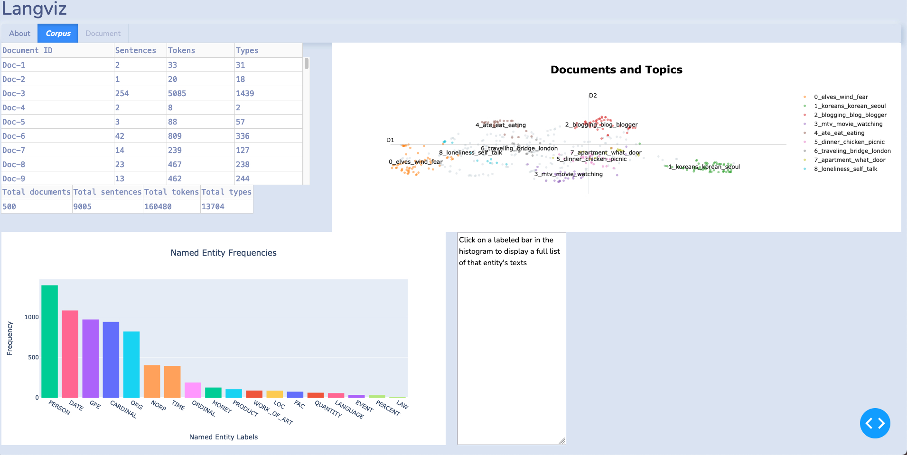
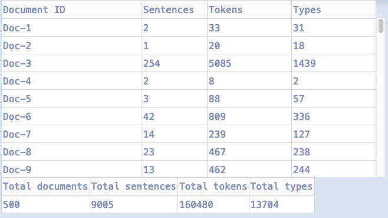
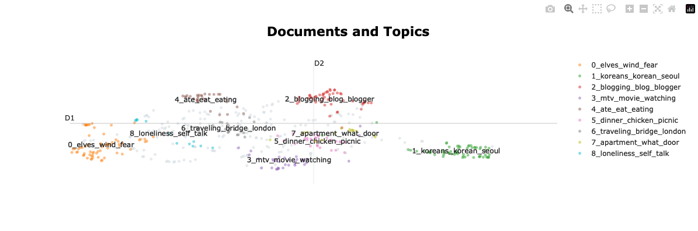
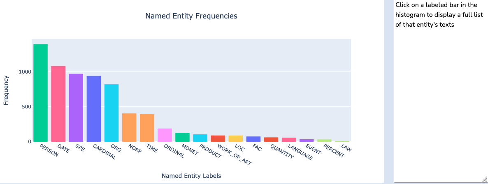
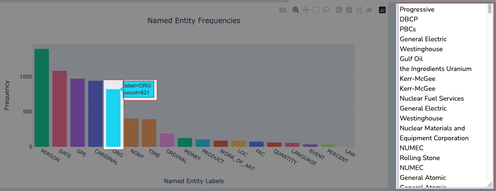

# Example: The Blog Authorship Corpus

(Updated as of 12/15/2023)

The [Blogs Authorship Corpus](https://u.cs.biu.ac.il/~koppel/BlogCorpus.htm) is a dataset consisting of blog posts from bloggers.com in August 2004. For faster development, **_I only took a subset of the first 500 documents in the dataset_**. You can find the cleaned subset in this directory: `blogtext_subset_cleaned.csv`

I performed the following cleaning operations:
```python
def clean_blog_text(text):
    text = re.sub(r"http\S+", "", text)
    text = re.sub(r".@.+\.(edu|com)", "", text) # theres not many emails in the corpus, so this regex should work fine
    text = re.sub(r"\d+;&.+", "", text)
    text = re.sub(r"&nbsp;?", " ", text)
    text = re.sub(r"&amp;", " ", text) 
    text = re.sub(r"urlLink", " ", text)  
    text = re.sub(r"--+", " ", text) 
    text = " ".join(text.strip().split()) 
    return text
```

To install Langviz, create a new environment with
```
python3 -m venv venv/
```

And run:
```
pip install git+https://github.com/eric-sclafani/langviz.git
```

Currently, Langviz only exposes a CLI command:
```
usage: langviz [-h] -p PATH -c COLUMN_NAME [-i ID]

CLI command for running the Langviz software

options:
  -h, --help            show this help message and exit
  -p PATH, --path PATH  Path to input data
  -c COLUMN_NAME, --column_name COLUMN_NAME
                        Name of column housing language data to analyze
  -i ID, --id ID        Unique row identifer. Must exist in dataset already
```

Using the blogs subset, run:
```
langviz -p path/to/blogtext_subset_cleaned.csv -c text  
```

After loading, you'll be greeted with the initial dashboard:


You can scroll through the table on the top right to view frequencies on the sentence, token, the type levels, as well as the totals:


The topic modeling is done using BERTopic and attempts to cluster together similar documents based off topic. You can also disable which clusters you don't want to view:


The Named Entity Frequencyies histogram displays the frequency of all named entites over the whole corpus:

Additionally, you can select a bar in the histogram and display a long list of all of the extracted entities:
